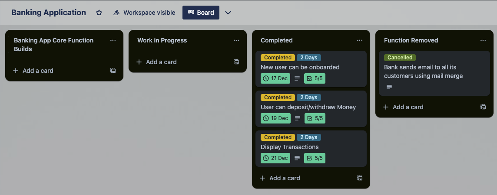
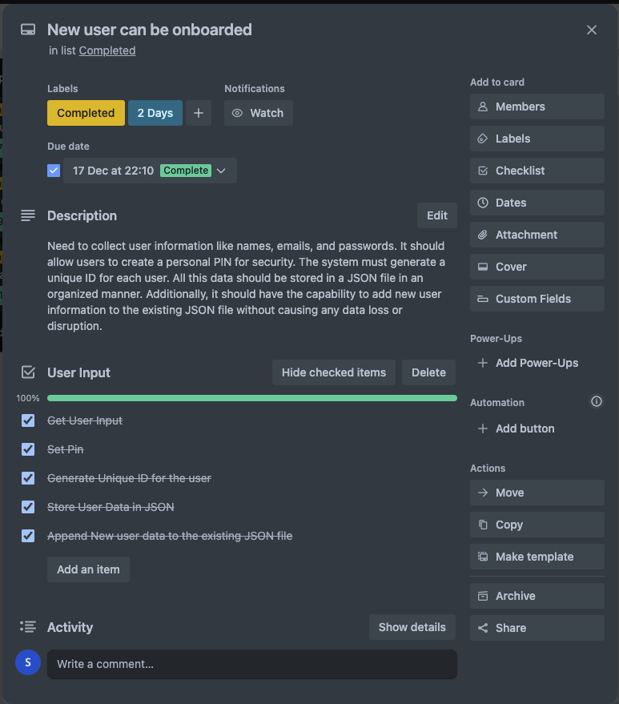
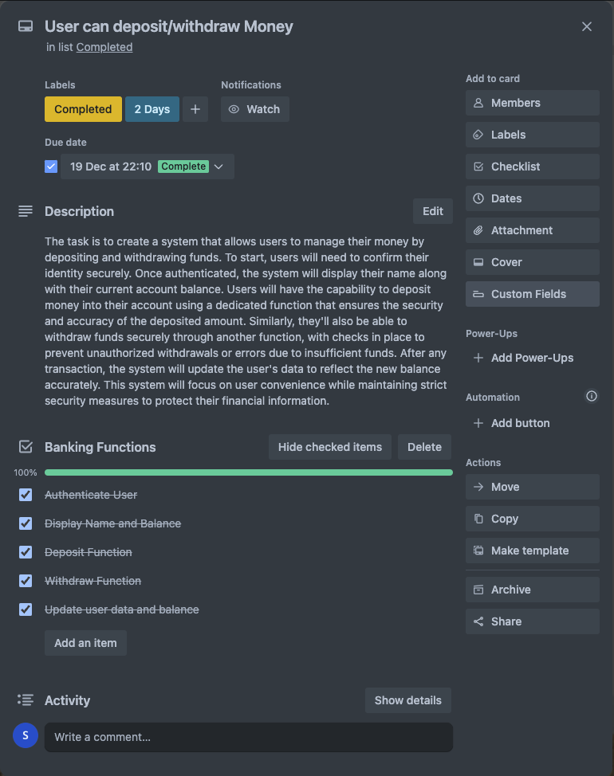
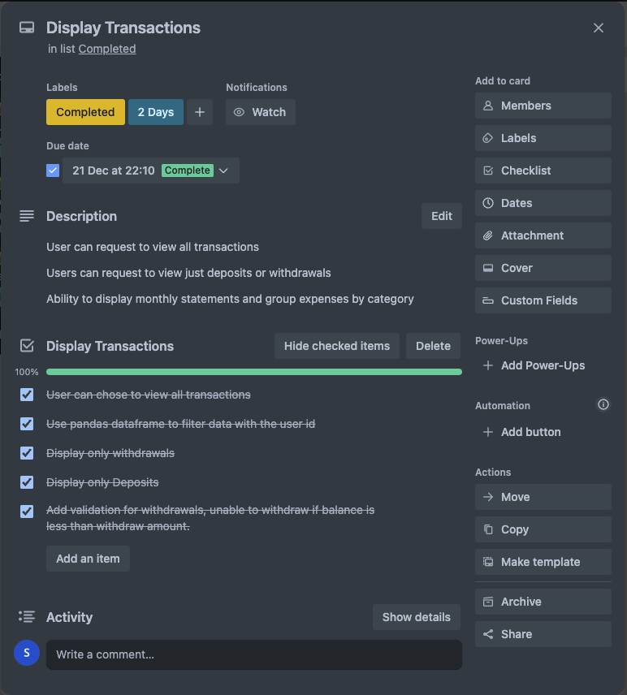
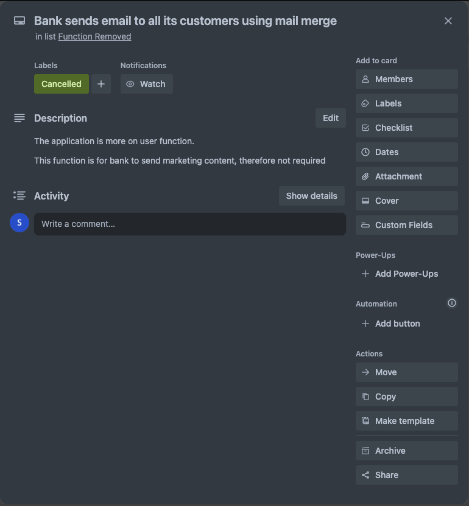

# Git Repository

# Code Style Guide

This application strictly adheres to the PEP 8 style guide for Python code.

Reference:
PEP 8 -- Style Guide for Python Code
URL: https://www.python.org/dev/peps/pep-0008/

# Application Features

- NewUser Class Definition:

  - Initializes a NewUser class to create user instances with specific attributes.
  - Attributes include user details like ID, name, date of birth, occupation, address, email, access pin, and balance.
  - Stores user data in a JSON file (user_data.json) by appending the new user data to the existing JSON data.

# Functions:

## User Management

- NewUser Class

  This class is used to create a new user object. When a new user is initialized, it collects various details like id, first_name, last_name, dob (date of birth), occupation, full_home_address, email, and access_pin. It then creates a dictionary new_user_data containing these details and appends this data to a JSON file named user_data.json located in the ./data/ directory.

- set_pin()

  This function prompts the user to set a numeric access pin. It validates the pin to ensure it matches certain criteria: it must be a numeric value and must match when re-entered for confirmation. If the criteria aren't met, the user is prompted to set the pin again until it meets the requirements.

- generate_id()

  This function generates a unique ID for each new user. It reads the existing user data from the JSON file and extracts the list of existing IDs. Then, it generates a new ID that is one more than the maximum existing ID. If no user data exists or there's an exception (such as a missing file), it generates a random ID between 100 and 1000.

- get_input() Function

  This function interacts with the user to gather information required to create a new user profile. It asks for details like first name, last name, date of birth, occupation, address, and email. It ensures that none of these fields are left blank and prompts the user to provide values for any empty fields. After collecting the required information, it prompts the user to set an access pin and generates a unique user ID using the generate_id() function. Finally, it creates a new NewUser object using the collected details.

## Display Transactions

- display_transactions(user_id, display_type)

  This function takes in two parameters: user_id (to filter transactions for a specific user) and display_type (to determine the type of transactions to display: "withdraw", "deposit", "all", or unspecified).

- Table Initialization

  The function initializes an empty PrettyTable named table and sets its field names based on the display_type.

- Filtering Transactions

  It filters the df DataFrame based on the user_id and the specified display_type. For withdrawals and deposits, it selects specific columns (transaction_type, transaction_date, transaction_amount). For displaying all transactions or unspecified types, it also includes the Balance.

- Iterating Through Transactions

  Iterates through the filtered transactions. For each transaction

  - It checks the transaction type and modifies the transaction_amount accordingly (enclosing withdrawal amounts in parentheses).
  - Updates the balance based on deposit or withdrawal.
  - Adds the transaction details (type, date, amount) to the PrettyTable.

- Displaying Transactions
  - If transactions are found for the specified user and type, it prints the table displaying the transactions in a formatted manner.
  - If no transactions are recorded for the user, it prints a message indicating the absence of recorded transactions.

## Updating User

- user_update(user_id)
  - File Operation
    - It opens the JSON file user_data.json in read mode to retrieve the user data.
    - It loads the JSON data into a variable named data.
  - Iterating through Users:
    - It loops through each user's data within the user_data list.
    - For the user matching the provided user_id, it prompts to edit various fields except for user_id, access_pin, and balance.
  - Field Editing:
    - For each field that can be edited, it asks the user if they want to modify the field.
    - If the user agrees (edit_field.lower() == "yes"), it prompts for a new value for the field and ensures the input is not blank or just spaces. If the user chooses to skip editing (new_value.lower() == "cancel"), it skips that field's editing process.
    - It updates the user's data with the new value for the field.
  - Displaying Updated Details:
    - After editing, it displays the updated user details for confirmation.
  - Saving Changes:
    - Once all changes are made, it saves the modified data back to the user_data.json file in a formatted (indented) manner.

## Project Management

link - https://trello.com/b/SWja4YUF/banking-application

### Project Kanban



### New User Onboarding



### Deposit/Withdraw Function



### Display Transaction Function



### Cancelled Function



## Help Documentation

### Requirements

# Banking Application Installation

Step 1: Clone the Repository
Open your terminal and run the following command:

```bash
git clone https://github.com/Suraj-Razor/BankingApplication.git
```

Step 2: Navigate to the Application Directory

```bash
cd BankingApplication
```

Usage:

Step 3: Setting Permissions

Before executing the scripts, ensure proper permissions are set:

```bash
chmod +x run.sh setup.sh
```

Step 4: Install Dependencies

Running the Application (Using run.sh):
The provided run.sh script automates the setup process:

```bash
./run.sh
```

## Requirements:

- Python 3.8 and Above

- The run.sh script automates the setup process by creating a Python virtual environment, installing dependencies listed in requirements.txt, executing setup (if applicable), and launching the application.

## Dependencies

The requirements.txt file contains the following dependencies:

```
colored==2.2.4
iniconfig==2.0.0
numpy==1.26.2
packaging==23.2
pandas==2.1.4
pluggy==1.3.0
prettytable==3.9.0
pytest==7.4.3
python-dateutil==2.8.2
pytz==2023.3.post1
six==1.16.0
tzdata==2023.3
wcwidth==0.2.12
```

These dependencies cover a range of functionalities such as data manipulation, testing, date and time handling, terminal formatting, and more.

## System Requirements

- Operating System: Compatible with Linux, macOS, and Windows.
- Python Version: Minimum Python 3.8 or higher.
- Hardware: No specific hardware requirements.

## Usage

Command Line Arguments: The Banking Application utilizes command line arguments.

The application can be started with below:

```bash
python main.py
```

# Test Cases for Banking Application

## Test Case 1: New User Creation Test

Description: Test the functionality for creating new users within the system.

Steps:

1. Create two test users (addinguser_test1 and addinguser_test2).
2. Retrieve user information from the stored JSON file.
3. Compare the information of the created test users with the retrieved user information.

Expected Result:

- The information of the test users (addinguser_test1 and addinguser_test2) should match the corresponding information retrieved from the stored JSON file.

## Test Case 2: Deposit Functionality Test

Description: Test the deposit functionality by adding funds to a user's account.

Steps:

1. Mock the input to simulate depositing an amount (e.g., 100) for a user (user_id = 123456789).
2. Retrieve the user's balance from the stored JSON file after the deposit.

Expected Result:

- The user's balance after the deposit should match the expected deposited amount (e.g., 100).

## Test Case 3: Withdrawal Functionality Test

Description: Test the withdrawal functionality by deducting funds from a user's account.

Steps:

1. Mock the input to simulate withdrawing an amount (e.g., 100) for a user (user_id = 123456789).
2. Retrieve the user's balance from the stored JSON file after the withdrawal.

Expected Result:

The user's balance after the withdrawal should be zero (0) if an amount of 100 was withdrawn successfully.

## Running Tests

To run tests for the Banking Application using pytest, follow these steps:

Ensure that you have installed the necessary dependencies.

Open a terminal and navigate to the Banking Application directory.

Run the following command:

```bash
pytest
```
